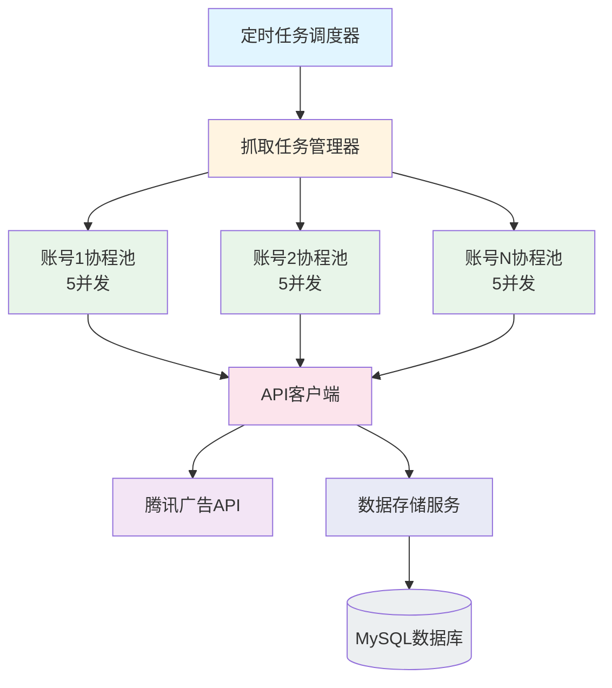

## 用户需求

设计一个基于协程池的多协程数据抓取系统，用于从腾讯广告 Marketing API 抓取海量报表数据。

### 核心需求

1. **触发方式**：定时任务（Cron 自动执行）
2. **数据范围**：指定账号 + 指定日期范围
3. **并发控制**：每个账号最多 5 个并发请求，不能无限制请求
4. **架构要求**：查询（读）和拉取（写）分开

- 查询模块：从数据库表读取数据，提供 API 查询接口
- 抓取模块：从腾讯广告 API 拉取数据，存储到数据库

5. **抓取对象**：

- 小时报表（HourlyReport）
- 广告系列（Campaign）
- 广告组（AdGroup）
- 广告（Ad）
- 广告素材（AdMaterial）
- 广告创意（AdCreative）

### 功能内容

- 协程池管理：每个账号独立协程池，最多 5 个并发 worker
- 任务队列：使用 channel 实现任务分发
- 定时任务：Cron 自动触发数据同步
- 失败重试：指数退避重试机制
- 任务状态跟踪：记录抓取任务状态，支持断点续传

### 视觉效果

- 前端可查看抓取任务状态（待处理/处理中/已完成/失败）
- 可手动触发抓取任务
- 可查看抓取进度和错误信息

## 技术栈选型

### 后端技术栈

- **语言**：Go 1.21+
- **框架**：Gin（已有）
- **ORM**：GORM v2（已有）
- **数据库**：MySQL 8.0+（已有）
- **定时任务**：robfig/cron/v3（已有）
- **HTTP 客户端**：Go 标准库 net/http
- **限流**：golang.org/x/time/rate

### 核心技术决策

1. **协程池实现**：使用 channel + goroutine 实现，每个账号独立协程池
2. **任务队列**：使用缓冲 channel（容量 100）作为任务队列
3. **并发控制**：使用 sync.WaitGroup 等待任务完成，context.Context 控制取消
4. **限流策略**：使用 token bucket 算法限制 API 请求频率
5. **错误处理**：指数退避重试（最大 3 次）

## 实现方案

### 系统架构



### 模块划分

#### 1. Crawler 模块（新增）

- **位置**：`internal/crawler/`
- **职责**：数据抓取核心逻辑
- **子模块**：
- `worker_pool.go` - 协程池实现
- `task_manager.go` - 任务管理器
- `api_client.go` - API 客户端封装
- `hourly_report_crawler.go` - 小时报表抓取
- `campaign_crawler.go` - 广告系列抓取
- `adgroup_crawler.go` - 广告组抓取
- `ad_crawler.go` - 广告抓取
- `creative_crawler.go` - 广告创意抓取
- `material_crawler.go` - 广告素材抓取

#### 2. Model 模块（扩展）

- **新增**：`internal/model/crawl_task.go` - 抓取任务模型
- **已有**：`internal/model/report.go`、`internal/model/oauth.go`

#### 3. Service 模块（扩展）

- **扩展**：`internal/service/report_service.go` - 新增查询方法
- **新增**：`internal/service/crawl_service.go` - 抓取服务

#### 4. Scheduler 模块（修改）

- **修改**：`internal/scheduler/scheduler.go` - 实现定时任务

#### 5. Handler 模块（扩展）

- **新增**：`internal/handler/crawler_handler.go` - 抓取控制接口

#### 6. Router 模块（修改）

- **修改**：`internal/router/router.go` - 注册新路由

### 核心数据结构

```
// CrawlTask 抓取任务表模型
type CrawlTask struct {
    ID           uint      `gorm:"primarykey" json:"id"`
    TaskID       string    `gorm:"uniqueIndex;size:64;not null;comment:任务唯一标识" json:"task_id"`
    AccountID    string    `gorm:"index;size:64;not null;comment:账号ID" json:"account_id"`
    DataType     string    `gorm:"size:50;not null;comment:数据类型" json:"data_type"`
    StartDate    time.Time `gorm:"not null;comment:开始日期" json:"start_date"`
    EndDate      time.Time `gorm:"not null;comment:结束日期" json:"end_date"`
    Status       int       `gorm:"default:0;comment:状态" json:"status"`
    Progress     int       `gorm:"default:0;comment:进度" json:"progress"`
    TotalCount   int       `gorm:"default:0;comment:总记录数" json:"total_count"`
    SuccessCount int       `gorm:"default:0;comment:成功数" json:"success_count"`
    FailCount    int       `gorm:"default:0;comment:失败数" json:"fail_count"`
    ErrorMsg     string    `gorm:"type:text;comment:错误信息" json:"error_msg"`
    RetryCount   int       `gorm:"default:0;comment:重试次数" json:"retry_count"`
    NextRetryAt  *time.Time `gorm:"comment:下次重试时间" json:"next_retry_at"`
    StartedAt    *time.Time `gorm:"comment:开始时间" json:"started_at"`
    CompletedAt  *time.Time `gorm:"comment:完成时间" json:"completed_at"`
    CreatedAt    time.Time `json:"created_at"`
    UpdatedAt    time.Time `json:"updated_at"`
}

// WorkerPool 协程池
type WorkerPool struct {
    accountID  string
    maxWorkers int
    taskQueue  chan CrawlTask
    ctx        context.Context
    cancel     context.CancelFunc
    wg         sync.WaitGroup
}

// TaskManager 任务管理器
type TaskManager struct {
    pools      map[string]*WorkerPool
    mutex      sync.RWMutex
    apiClient  *APIClient
    dbService  *service.ReportService
}
```

### 实现要点

#### 协程池实现

1. 每个账号创建独立的 WorkerPool，最大 worker 数为 5
2. 使用 `chan CrawlTask` 作为任务队列，缓冲大小 100
3. Worker 从队列中获取任务并执行
4. 使用 `sync.WaitGroup` 等待所有任务完成
5. 使用 `context.Context` 支持优雅关闭

#### API 客户端实现

1. 封装腾讯广告 API 调用
2. 使用 `rate.Limiter` 限制请求频率
3. 实现指数退避重试（1s, 2s, 4s）
4. 自动刷新 AccessToken

#### 定时任务实现

1. 使用 `robfig/cron/v3` 实现 Cron 调度
2. 广告结构数据（Campaign/AdGroup/Ad/Creative/Material）：每 6 小时同步
3. 小时报表（HourlyReport）：每小时同步
4. 支持手动触发和自动触发两种模式

### 目录结构

```
backend/
├── internal/
│   ├── crawler/                    # [NEW] 数据抓取模块
│   │   ├── worker_pool.go         # 协程池实现
│   │   ├── task_manager.go        # 任务管理器
│   │   ├── api_client.go          # API客户端封装
│   │   ├── hourly_report_crawler.go  # 小时报表抓取
│   │   ├── campaign_crawler.go    # 广告系列抓取
│   │   ├── adgroup_crawler.go     # 广告组抓取
│   │   ├── ad_crawler.go         # 广告抓取
│   │   ├── creative_crawler.go    # 广告创意抓取
│   │   └── material_crawler.go    # 广告素材抓取
│   ├── model/
│   │   ├── crawl_task.go          # [NEW] 抓取任务模型
│   │   ├── report.go              # [EXISTING] 报表模型
│   │   └── oauth.go               # [EXISTING] OAuth模型
│   ├── service/
│   │   ├── report_service.go      # [MODIFY] 扩展查询方法
│   │   └── crawl_service.go       # [NEW] 抓取服务
│   ├── handler/
│   │   ├── crawler_handler.go     # [NEW] 抓取控制接口
│   │   └── report_handler.go      # [EXISTING] 报表接口
│   ├── scheduler/
│   │   └── scheduler.go           # [MODIFY] 实现定时任务
│   └── router/
│       └── router.go              # [MODIFY] 注册新路由
├── config.yaml                     # [MODIFY] 新增抓取配置
└── main.go                        # [EXISTING] 入口文件
```

### 配置文件扩展

在 `config.yaml` 中新增配置：

```
# 数据抓取配置
crawler:
  max_workers_per_account: 5       # 每个账号最大并发数
  task_queue_size: 100             # 任务队列大小
  max_retry: 3                     # 最大重试次数
  retry_delay: 5                   # 重试延迟（秒）
  request_timeout: 30              # 请求超时（秒）
  rate_limit: 10                   # API限流（每秒请求数）
  campaign_cron: "0 */6 * * *"    # 每6小时同步广告系列
  adgroup_cron: "0 */6 * * *"     # 每6小时同步广告组
  ad_cron: "0 */6 * * *"          # 每6小时同步广告
  creative_cron: "0 */6 * * *"    # 每6小时同步广告创意
  material_cron: "0 */6 * * *"    # 每6小时同步广告素材
  hourly_report_cron: "0 * * * *"  # 每小时同步小时报表
```

## 实施计划

### 第一阶段：基础框架（1-2天）

1. 创建 `internal/crawler/` 目录结构
2. 实现协程池（WorkerPool）
3. 实现任务管理器（TaskManager）
4. 实现 API 客户端基础框架

### 第二阶段：数据抓取（2-3天）

1. 实现小时报表抓取器
2. 实现广告系列抓取器
3. 实现广告组抓取器
4. 实现广告抓取器
5. 实现广告创意抓取器
6. 实现广告素材抓取器

### 第三阶段：定时任务（1天）

1. 扩展 config.yaml 配置
2. 实现定时任务调度
3. 实现手动触发接口

### 第四阶段：查询接口（1天）

1. 新增广告系列查询接口
2. 新增广告组查询接口
3. 新增广告查询接口
4. 新增广告创意查询接口
5. 新增广告素材查询接口

### 第五阶段：测试优化（1-2天）

1. 单元测试
2. 集成测试
3. 性能测试和优化

## 关键代码示例

### WorkerPool 核心实现

```
// WorkerPool 协程池
type WorkerPool struct {
    accountID  string
    maxWorkers int
    taskQueue  chan model.CrawlTask
    ctx        context.Context
    cancel     context.CancelFunc
    wg         sync.WaitGroup
    apiClient  *APIClient
    dbService  *service.ReportService
}

// NewWorkerPool 创建协程池
func NewWorkerPool(accountID string, maxWorkers int) *WorkerPool {
    ctx, cancel := context.WithCancel(context.Background())
    return &WorkerPool{
        accountID:  accountID,
        maxWorkers: maxWorkers,
        taskQueue:  make(chan model.CrawlTask, 100),
        ctx:        ctx,
        cancel:     cancel,
    }
}

// Start 启动协程池
func (p *WorkerPool) Start() {
    for i := 0; i < p.maxWorkers; i++ {
        p.wg.Add(1)
        go p.worker(i)
    }
}

// worker 工作协程
func (p *WorkerPool) worker(workerID int) {
    defer p.wg.Done()
    
    for {
        select {
        case task := <-p.taskQueue:
            p.processTask(task)
        case <-p.ctx.Done():
            return
        }
    }
}

// AddTask 添加任务到队列
func (p *WorkerPool) AddTask(task model.CrawlTask) {
    p.taskQueue <- task
}

// Stop 停止协程池
func (p *WorkerPool) Stop() {
    p.cancel()
    p.wg.Wait()
    close(p.taskQueue)
}
```

### TaskManager 核心实现

```
// TaskManager 任务管理器
type TaskManager struct {
    pools      map[string]*WorkerPool
    mutex      sync.RWMutex
    apiClient  *APIClient
    dbService  *service.ReportService
}

// NewTaskManager 创建任务管理器
func NewTaskManager() *TaskManager {
    return &TaskManager{
        pools:     make(map[string]*WorkerPool),
        apiClient: NewAPIClient(),
        dbService: service.NewReportService(),
    }
}

// StartCrawl 启动抓取任务
func (m *TaskManager) StartCrawl(req *CrawlRequest) error {
    for _, accountID := range req.AccountIDs {
        pool := m.getOrCreatePool(accountID)
        
        for _, dataType := range req.DataTypes {
            task := model.CrawlTask{
                TaskID:    generateTaskID(accountID, dataType),
                AccountID: accountID,
                DataType:  string(dataType),
                StartDate: req.StartDate,
                EndDate:   req.EndDate,
                Status:    0, // 待处理
            }
            
            // 保存任务到数据库
            m.dbService.SaveCrawlTask(&task)
            
            // 添加到协程池队列
            pool.AddTask(task)
        }
    }
    return nil
}

// getOrCreatePool 获取或创建协程池
func (m *TaskManager) getOrCreatePool(accountID string) *WorkerPool {
    m.mutex.RLock()
    pool, exists := m.pools[accountID]
    m.mutex.RUnlock()
    
    if exists {
        return pool
    }
    
    m.mutex.Lock()
    defer m.mutex.Unlock()
    
    // Double check
    pool, exists = m.pools[accountID]
    if exists {
        return pool
    }
    
    pool = NewWorkerPool(accountID, 5)
    pool.Start()
    m.pools[accountID] = pool
    
    return pool
}
```

## 性能优化

### 数据库优化

1. 批量插入：使用 `CreateInBatches` 批量写入，批次大小 100-500
2. UPSERT：使用 `ON DUPLICATE KEY UPDATE` 避免重复
3. 索引优化：确保查询字段有索引

### API 调用优化

1. 请求合并：相同账号相同时间范围的数据合并请求
2. 限流控制：使用 token bucket 算法限制请求频率
3. 连接复用：HTTP Client 使用连接池

### 内存优化

1. 流式处理：大数据量时流式处理，避免一次性加载到内存
2. 对象复用：使用 sync.Pool 复用对象
3. 及时释放：处理完的数据及时释放引用

## 错误处理

### API 调用错误

1. 网络错误：指数退避重试（最大 3 次）
2. API 限流（429）：等待后重试
3. 认证错误（401）：刷新 Token 后重试
4. 参数错误（400）：记录错误，跳过该任务

### 数据存储错误

1. 数据库连接失败：任务进入重试队列
2. 数据格式错误：记录错误日志，跳过该条数据

### 协程池错误

1. Worker panic：捕获并记录，重启 worker
2. 任务超时：取消当前任务，返回超时错误

## 设计风格

采用现代化数据管理平台设计风格，主色调为专业蓝（#409EFF），搭配浅灰背景（#F5F7FA）。界面分为左右布局：左侧为导航菜单，右侧为内容区域。

## 页面规划

### 1. 数据抓取控制台（Crawler Dashboard）

**功能块**：

- 顶部：抓取任务统计卡片（总任务数、运行中、已完成、失败）
- 中部：正在运行的任务列表（账号、数据类型、进度、状态）
- 底部：近期任务历史记录

### 2. 抓取任务管理（Crawler Tasks）

**功能块**：

- 顶部：筛选栏（状态、账号、数据类型、时间范围）
- 中部：任务列表表格（任务ID、账号、数据类型、状态、进度、创建时间、操作）
- 底部：分页控件

### 3. 手动触发抓取（Crawler Manual）

**功能块**：

- 表单区域：选择账号、选择数据类型、设置日期范围
- 操作按钮：开始抓取、取消
- 实时日志：显示抓取进度日志

### 4. 数据查询页面（Data Query）

**功能块**：

- 筛选区域：账号选择、日期范围、数据类型切换
- 数据表格：显示查询结果（小时报表/广告系列/广告组/广告/创意/素材）
- 图表区域：数据可视化（ECharts 折线图/柱状图）

## 交互设计

- 实时更新：使用 WebSocket 或轮询更新任务状态
- 进度展示：每个任务显示进度条和百分比
- 操作反馈：按钮点击后有 loading 状态和成功/失败提示
- 错误处理：失败任务显示错误详情，支持一键重试

## Agent Extensions

### SubAgent

- **code-explorer**
- Purpose: 探索现有代码结构，了解项目架构和依赖关系
- Expected outcome: 获取完整的代码库结构信息，为实施计划提供准确的代码位置和建议